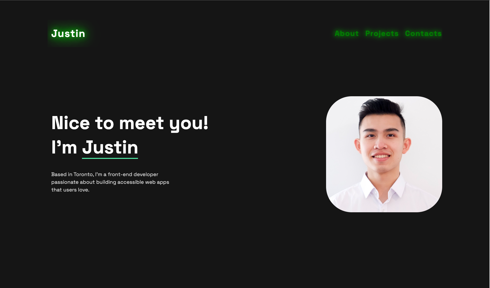

# MY-PORTFOLIO-WEB-SITE

**My portfolio website is a showcase of my software engineering skills, featuring a collection of projects that highlight my technical expertise and passion for innovation in the field**

## Table of contents

- [Overview](#overview)
  - [Screenshot](#screenshot)
  - [Links](#links)
  - [Built with](#built-width)
- [Author](#author)

## Overview

### Screenshot

### Links

- Solution URL: [github](https://github.com/tin0312/my-portfolio-website)
- Live URL : [Netlify](https://fabulous-lily-7976cc.netlify.app/)

### Built-with

1. HTML
2. CSS
3. [Bootstrap 5](https://getbootstrap.com/docs/5.0/getting-started/introduction/)
4. JavaScript (ES6+)
5. [React](https://react.dev/)
6. [React-router](https://reactrouter.com/en/main)

### Author

- Website - [Justin](https://fabulous-lily-7976cc.netlify.app/)
